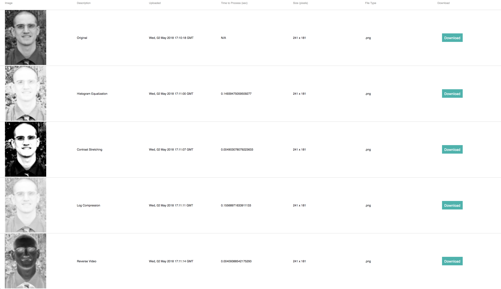

# OlderThanYou_testing
Unit Testing and Continuous Integration with Travis CI (Assignment 04)

Brief description of what you built and what it does (1-2 paragraphs)
Screenshot (for doctor-hr-frontend)
Basic setup instructions (e.g. cd blah then run "npm install" then run "npm run start", or "pip install -r requirements.txt", etc)
Any travis CI or documentation badges 

# IPs18_backend

This project interacts with [ImageUploadFrontEnd](https://github.com/vertikoff/ImageUploadFrontEnd) and
[IPs18_frontend](https://github.com/jlongc12/IPs18_frontend).

## Functionality

Image_processing.py is a group of functions under a single class, ImageProcessing. Each of these function accept a dict
described below and return a base64 string for an encoded '.png' image. The program can accept both color and greyscale
images but color images will be converted to greyscale and returned as greyscale. The program can accept individual
image in '.png' and '.tiff' format. If an incorrect filetype is submitted, the program will alert the user and exit.
The functions are as follows:

- Histogram Equalization
    - Uses [exposure.equalize_hist](http://scikit-image.org/docs/dev/auto_examples/color_exposure/plot_equalize.html?highlight=histogram%20equalization)
    from [skimage](http://scikit-image.org/) to enhance images with low contrast.
- Contrast Stretching
    - Uses [exposure.rescale_intensity](http://scikit-image.org/docs/dev/auto_examples/color_exposure/plot_equalize.html?highlight=histogram%20equalization)
    from [skimage](http://scikit-image.org/) to enhance images with low contrast.
- Log Compression
    - Uses a formula described [here](https://homepages.inf.ed.ac.uk/rbf/HIPR2/pixlog.htm) to compress the dynamic
    range of an image
- Reverse Video
    - Inverts the greyscale of an image (i.e. black become white).

## Screenshots

 
## Travis
Travis CI was used for this build.

## Setup
To setup this program one must execute the following commands.

Use pip to install all of the requirements from "requirements.txt"

*"pip install -r requirements.txt"*

Then one must import the class ImageProcessing from Image_Processing.

*"from Image_Processing import ImageProcessing"*
